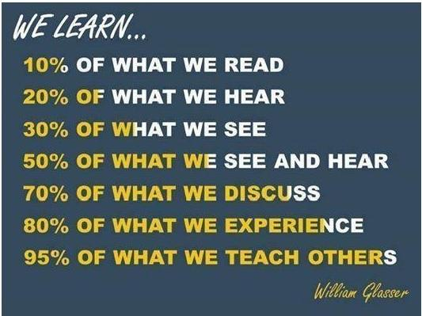
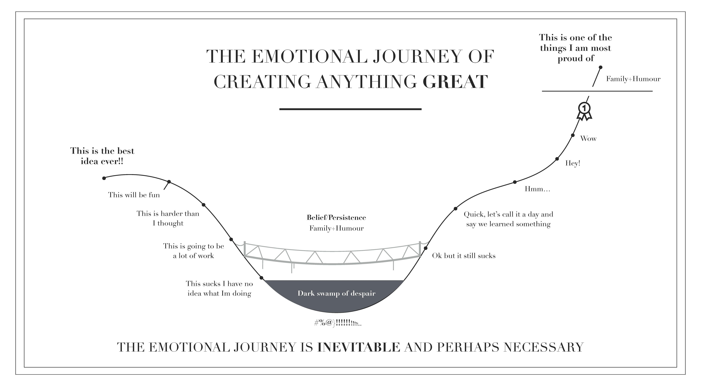

# Lecture #1: Introduction

_2 October 2018_

## Frequently Asked Questions

### Who are you?

My name is Matej Mojzeš and I will be your lecturer, I also:

* Have a Ph.D. in integer optimization heuristics at the Deptartment of Software Engineering, FNSPE CTU in Prague
* Work as a Data Detectives Team Lead at [Jumpshot](https://www.jumpshot.com) (and we are [hiring](mailto:matej.mojzes@jumpshot.com))
* Posess several years of experience in Business Intelligence, Data Warehousing and Data Science in both start-up and enterprise environments

Feel free to see more on my [LinkedIn profile](https://www.linkedin.com/in/matejmojzes) and add me to your network.

### What is this course about?

Selected aspects of [Business Intelligence](https://en.wikipedia.org/wiki/Business_intelligence), [Decision Support Systems](https://en.wikipedia.org/wiki/Decision_support_system), and [Big Data](https://en.wikipedia.org/wiki/Big_data), including, but not limited to:

* how to move collections of data from one place, format, and source to another (i.e. [ETL](https://en.wikipedia.org/wiki/Extract,_transform,_load), data pumps, etc.),
* how to store data in a way that allows for their quick analysis ([OLAP](https://en.wikipedia.org/wiki/Online_analytical_processing), and another types of analytical databases),
* what is reporting and how to practially approach it,
* how to efficiently perform ad-hoc data analysis, and 
* mine knowledge out of data.

### What prerequisite skills are recommended?

* The most important is SQL
* For data analysis: [Python](https://www.stat.washington.edu/~hoytak/blog/whypython.html), R
* For fast and big data processing: Java, Scala

Note: We will learn a bit of them in the course of the semester.

### Why do you teach it?

1. Because I believe that working in Business Intelligence and Data Science environments is one of the best things that could have happened to me, as a graduate of FNSPE. 
2. Also because I usually learn the most by preparing and giving talks to other people. **I suggest you to do the same**, hence the answer to the next question.

### How can I get the _zápočet_?

By:
* actively attending the classes (I may test you with a quick assessment here and there), 
* discussing and working on your own project (I will support you as much as I can),
* presenting your results to your classmates.

Nota bene, how it will look like:

### More questions?

Let me answer your questions right away. Should you forget, please post the question here using a [pull request](https://help.github.com/articles/about-pull-requests/).

## So what do we do today?

First of all, **send me your e-mail address**, so that I can keep you posted on any important organizational news.

And then... **let's talk**! I would like to know something about your motivation, experience, what are you interested in. It will help me to personalize the course.
